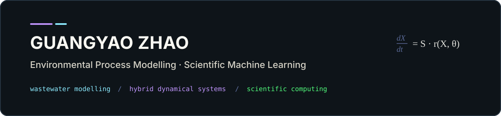
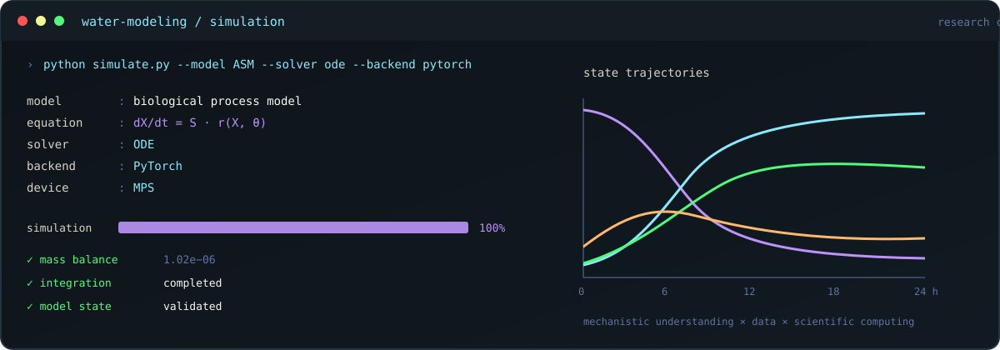

  

  <a href="https://www.cigit-swr.com/tdcy/bsh/1614.html">CIGIT</a> ·
  <a href="https://cigit-zgy.vercel.app/">BLOG</a> ·
  <a href="https://orcid.org/0009-0001-7406-5638">ORCID</a>

<strong>Assistant Research Professor · Chongqing Institute of Green and Intelligent Technology, Chinese Academy of Sciences</strong>

I am an environmental process modeller working at the intersection of **mechanistic modelling**, **hybrid dynamical systems**, and **scientific machine learning**, with a focus on biological wastewater treatment and reproducible scientific computing.

---

### Research Areas

**01 · Biological Process Modelling**  
Activated sludge · Anaerobic digestion · Nitrogen and phosphorus removal · Dynamic simulation

**02 · Hybrid Dynamical Systems**  
Hybrid ODE · Neural ODE · Sensor-guided modelling · System identification

**03 · Scientific Machine Learning**  
Interpretable learning · Soft sensors · Mechanistic–data-driven modelling · Research software

  

### Research Focus

> Full-scale wastewater treatment modelling · Hybrid mechanistic–data-driven dynamics · Online-sensor-informed modelling · Model interpretation

---

### Latest Research

**2026 · Full-scale nitrification dynamics**  
Online sensor-guided hybrid ODE integrating ASM3 and an artificial neural network for a 69-day full-scale municipal wastewater treatment plant operation.  
[Paper](https://doi.org/10.1016/j.biortech.2026.135665) · *Bioresource Technology*

---

### Research Timeline

| Year | Research step | Public outcome |
| --- | --- | --- |
| **2022** | Machine-learning soft sensing | Biodegradable organic matter estimation from wastewater measurements |
| **2024** | Supporting-data hybrid dynamics | Hybrid ODE for phosphate dynamics in municipal wastewater treatment |
| **2025** | Parallel hybrid ODE | Enhanced prediction and physical interpretability for biological phosphorus removal |
| **2026** | Full-scale sensor-guided Hybrid ODE | Nitrification dynamics in a municipal wastewater treatment plant |

The progression reflects a continuous research line from **data-driven estimation** to **mechanistic–data-driven dynamical modelling** and **full-scale process application**.

---

### Selected Research & Software

**[`sci-manuscript-skill`](https://github.com/cigit-zgy/sci-manuscript-skill)**  
An open-source LaTeX manuscript lifecycle workflow for reproducible initial submission, adjacent revision rounds, highlighted revised manuscripts, reviewer responses, and submission artifacts. Built-in workflows cover Elsevier, Nature, ACS, and Chinese manuscripts while keeping scientific content under author control.  
`v2.1.0` · `Python 3.11+` · `MIT`

`initialize → build → revise → validate → respond → submit`

**[`latex-templates`](https://github.com/cigit-zgy/latex-templates)**  
Reusable XeLaTeX templates for academic theses and scientific reports, with independent bilingual English/Chinese layouts, deterministic typography, mandatory full-width tables, and reproducible rendered previews.

**[`water-modeling-notes`](https://github.com/cigit-zgy/water-modeling-notes)**  
Academic notes and computational resources for water-system modelling, scientific machine learning, and numerical methods.

---

### Open Research

`Research software` · `Reproducible workflows` · `Academic notes` · `LaTeX tooling`

My public GitHub work focuses on making scientific modelling, manuscript preparation, and computational research easier to inspect, reproduce, and reuse. The repositories above contain only openly released research software, documentation, and academic resources.

---

### Selected Publications · First Author

1. Zhao, G.-Y., Sato, N., Yin, F., Liu, H., & Fujita, M. (2026). Online sensor-guided hybrid ordinary differential equation-based model of nitrification dynamics in a full-scale municipal wastewater treatment plant. *Bioresource Technology*, 135665. **[https://doi.org/10.1016/j.biortech.2026.135665](https://doi.org/10.1016/j.biortech.2026.135665)**

2. Zhao, G.-Y., Furumai, H., & Fujita, M. (2025). Parallel hybrid ordinary differential equation for modeling biological phosphorus removal modified for enhanced predictive performance and physical interpretability. *Journal of Environmental Management*, **380**, 124932. **[https://doi.org/10.1016/j.jenvman.2025.124932](https://doi.org/10.1016/j.jenvman.2025.124932)**

3. Zhao, G.-Y., Furumai, H., & Fujita, M. (2024). Supporting data–enhanced hybrid ordinary differential equation model for phosphate dynamics in municipal wastewater treatment. *Bioresource Technology*, **409**, 131217. **[https://doi.org/10.1016/j.biortech.2024.131217](https://doi.org/10.1016/j.biortech.2024.131217)**

[Full publication record on ORCID](https://orcid.org/0009-0001-7406-5638)

---

### Research Interests

Wastewater treatment modelling · Activated Sludge Models · Anaerobic digestion · Biological nutrient removal · Hybrid ODE · Neural ODE · Scientific machine learning · Interpretable machine learning

### Computational Stack

`Python` · `PyTorch` · `NumPy` · `SciPy` · `Pandas` · `Matplotlib` · `torchdyn`

<i>Mechanistic understanding · Data-informed dynamics · Reproducible scientific computing</i>

